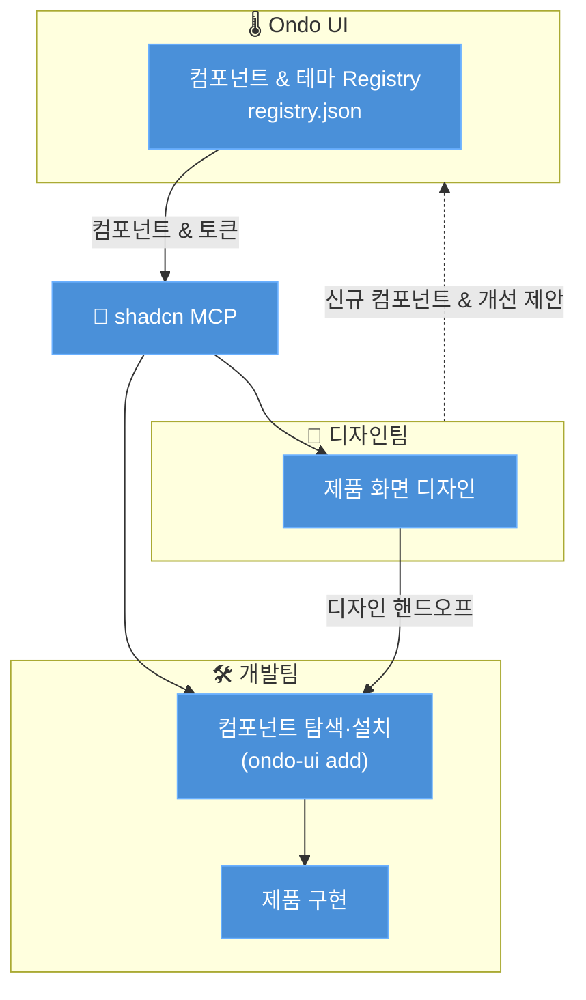

# Ondo UI

[English](README.md)

Ondo UI는 따뜻하고 신뢰감 있는 무드를 지향하는 오픈소스 디자인 시스템입니다. 어린 사용자부터 나이 든 사용자까지 모든 세대가 낯설거나 부담스럽지 않게, 안심하고 쓸 수 있도록 데스크탑과 모바일 모두를 기준으로 설계했습니다. 컴포넌트·토큰·테마를 shadcn registry로 배포해, 디자인과 코드가 늘 같은 소스를 공유합니다.

## 누가 쓰나요

디자인팀은 Ondo UI의 컴포넌트와 토큰 위에서 화면을 설계하고, 개발팀은 같은 registry 컴포넌트를 shadcn MCP로 설치해 그 디자인을 그대로 구현합니다. 둘이 따로 만들지 않고, 하나의 소스로 맞춰 갑니다.

## 어디에 어울리나요

특정 분야에 매이지 않습니다. 넓은 연령대가 쓰거나, 편안함과 신뢰가 중요한 제품이라면 어디든 잘 맞습니다. 화려함보다 명료함, 복잡함보다 편안함이 필요한 곳이라면 — 웹이든 앱이든 하나의 일관된 무드로 이어 줍니다.

## 왜 Ondo인가요

"온도(Ondo)"는 모든 제품의 무드를 일정한 온도로 맞추는 일을 뜻합니다. 토큰은 °C, 라이트/다크는 Warm/Cool처럼 — 브랜드가 하나의 감각으로 이어집니다.

## 작업 흐름

Ondo UI는 디자인–개발 순환의 중심에 있습니다. 디자인팀과 개발팀 모두 **shadcn MCP**를 통해 같은 registry에 접근합니다. 디자인팀은 Ondo UI의 컴포넌트와 토큰을 기반으로 제품 화면을 디자인하고, 개발팀은 그 디자인을 동일한 registry 컴포넌트로 구현합니다. 디자인과 코드가 항상 하나의 소스를 공유합니다.



1. **Ondo UI**가 컴포넌트·테마·토큰을 shadcn registry로 배포합니다.
2. **디자인팀**과 **개발팀** 모두 shadcn MCP를 통해 동일한 registry에 접근합니다.
3. 디자인팀이 Ondo UI 컴포넌트를 기반으로 제품 화면을 디자인해 개발팀에 전달합니다.
4. 개발팀이 MCP나 `ondo-ui add`로 컴포넌트를 탐색하고 설치해 디자인을 구현합니다.
5. 디자인 과정에서 나온 신규 컴포넌트와 개선 제안은 다시 Ondo UI에 반영되고, 순환이 반복됩니다.

## shadcn MCP 설정

두 단계면 AI 도구(Claude Code, Cursor 등)에서 Ondo UI registry를 사용할 수 있습니다.

**1. 레지스트리 등록** — 프로젝트의 `components.json`에 `@ondo-ui` 네임스페이스를 추가합니다:

```json
{
  "registries": {
    "@ondo-ui": "https://ui.ondo.dou.so/r/{name}.json"
  }
}
```

**2. MCP 서버 등록** — 사용하는 클라이언트에 맞춰 실행합니다:

```bash
bunx --bun @dou.so/ondo-ui@latest mcp init --client claude   # Claude Code
bunx --bun @dou.so/ondo-ui@latest mcp init --client cursor   # Cursor
bunx --bun @dou.so/ondo-ui@latest mcp init --client vscode   # VS Code
```

설정 후에는 AI에게 자연어로 요청하면 됩니다:

- "@ondo-ui 레지스트리에 있는 컴포넌트를 보여줘"
- "@ondo-ui의 button과 card를 이 페이지에 추가해줘"

자세한 내용은 [설치 문서](https://ui.ondo.dou.so/ko/docs/installation)를 참고하세요.

## Ondo CLI

Ondo CLI로 지원되는 framework를 초기화하고 레지스트리를 설정한 뒤
Components와 Compositions를 설치할 수 있습니다:

```bash
bunx --bun @dou.so/ondo-ui@latest init -t astro
bunx --bun @dou.so/ondo-ui@latest add
bunx --bun @dou.so/ondo-ui@latest add button empty-view
bunx --bun @dou.so/ondo-ui@latest add --all
bunx --bun @dou.so/ondo-ui@latest docs button
bunx --bun @dou.so/ondo-ui@latest docs empty-view --json
```

`search`, `list`, `view`, `docs`, `diff`, `apply`, `info`, `migrate`, `eject`,
`mcp`, `preset`, `build`, `registry` 같은 shadcn 프로젝트·registry 명령도
지원합니다. 명령 옵션, Compositions, 시스템 항목, `--cwd` 사용법은
[CLI 레퍼런스](https://ui.ondo.dou.so/ko/docs/cli)에서 확인하세요.

## Ondo UI Skill

AI 어시스턴트에 Ondo 프로젝트 컨텍스트, Base UI 패턴, 컴포넌트와
Composition 규칙을 제공하는 저장소 기반 Skill을 설치합니다:

```bash
npx skills add douinc/ondo-ui
```

Skill은 npm CLI 패키지가 아니라 GitHub 저장소에서 설치됩니다. 포함된 지식과
예시 프롬프트는 [Skills 가이드](https://ui.ondo.dou.so/ko/docs/skills)에서
확인하세요.

## 컴포넌트 추가하기

앱에 컴포넌트를 추가하려면 다음 명령어를 실행하세요:

```bash
bunx --bun @dou.so/ondo-ui@latest add button
```

이 명령어는 UI 컴포넌트를 `components` 디렉토리에 배치합니다.

## 컴포넌트 사용하기

앱에서 컴포넌트를 사용하려면 다음과 같이 import 하세요:

```tsx
import { Button } from "@/components/ui/button";
```

## 기여자

<a href="https://github.com/douinc/ondo-ui/graphs/contributors">
  
</a>
