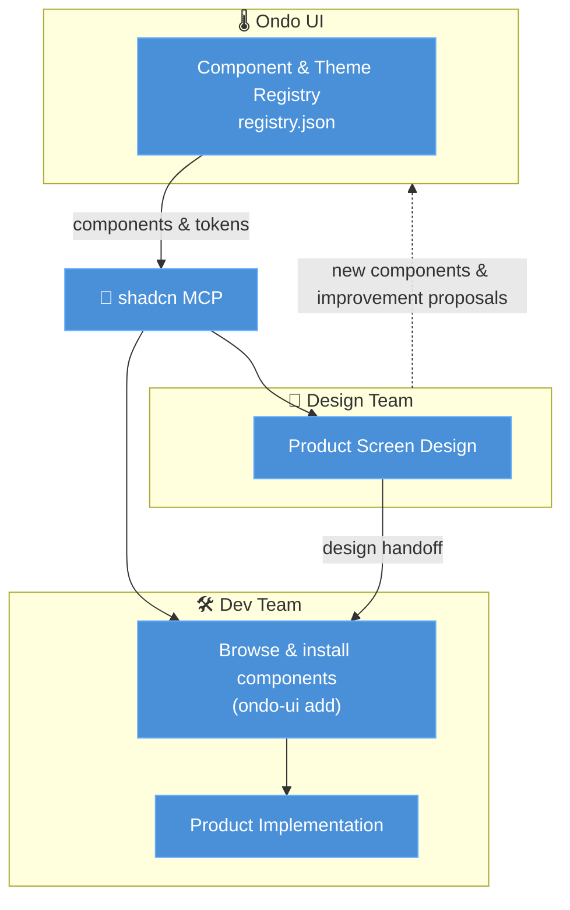

# Ondo UI

[한국어](README_KO.md)

Ondo UI is an open-source design system with a warm, trustworthy mood. It's built so everyone — from the youngest users to the oldest — can reach for it comfortably and with confidence, never finding it unfamiliar or heavy. Designed for both desktop and mobile, it ships components, tokens, and themes as a shadcn registry, so design and code always share one source.

## Who uses it

Designers build screens on top of Ondo UI's components and tokens; developers install those same registry components through the shadcn MCP and implement the design as-is. The two don't build separate things — they stay aligned on a single source.

## Where it fits

Ondo UI isn't tied to any one domain. It suits any product used across a wide range of ages, or wherever comfort and trust matter most. Where clarity beats flash and ease beats complexity — on web or app alike — it carries one consistent mood.

## Why Ondo

"Ondo" means temperature — the work of keeping every product's mood at one steady warmth. Tokens as °C, light and dark as Warm and Cool: one brand, felt as a single temperature.

## Workflow

Ondo UI sits at the center of a design–development loop. Both the design team and the dev team access the same registry through the **shadcn MCP**: the design team designs product screens on top of Ondo UI's components and tokens, and the dev team implements those designs with the exact same registry components — so design and code always share a single source of truth.



1. **Ondo UI** publishes components, themes, and tokens as a shadcn registry.
2. Both the **design team** and the **dev team** access the same registry through the shadcn MCP.
3. The design team designs product screens on top of Ondo UI components and hands them off to the dev team.
4. The dev team browses components via the MCP or `ondo-ui add` and installs them to implement the designs.
5. New components and improvements proposed during design flow back into Ondo UI, and the loop repeats.

## Setting up the shadcn MCP

Two steps make the Ondo UI registry available to AI tools (Claude Code, Cursor, etc.).

**1. Register the registry** — add the `@ondo-ui` namespace to your project's `components.json`:

```json
{
  "registries": {
    "@ondo-ui": "https://ui.ondo.dou.so/r/{name}.json"
  }
}
```

**2. Register the MCP server** — run the command for your client:

```bash
npx shadcn@latest mcp init --client claude   # Claude Code
npx shadcn@latest mcp init --client cursor   # Cursor
npx shadcn@latest mcp init --client vscode   # VS Code
```

Once configured, just ask your AI in natural language:

- "Show me the components in the @ondo-ui registry"
- "Add @ondo-ui button and card to this page"

See the [installation docs](https://ui.ondo.dou.so/docs/installation) for details.

## Ondo CLI

Initialize a supported framework and install the Ondo theme:

```bash
bunx --bun @dou.so/ondo-ui init -t astro
```

Open the grouped Components and Compositions menu:

```bash
bunx --bun @dou.so/ondo-ui add
```

Install items directly or preview the changes:

```bash
bunx --bun @dou.so/ondo-ui add button empty-view
bunx --bun @dou.so/ondo-ui add button --dry-run
bunx --bun @dou.so/ondo-ui add --all
```

The menu separates registry UI components from ready-made Compositions such
as `empty-view` and `number-badge`. System items such as `theme-provider` are
available by explicit name but are not included in the default menu.

The CLI also forwards the project and registry commands from shadcn:

```bash
bunx --bun @dou.so/ondo-ui search --query button
bunx --bun @dou.so/ondo-ui view @ondo-ui/button
bunx --bun @dou.so/ondo-ui info
bunx --bun @dou.so/ondo-ui mcp init --client claude
```

Use `--cwd <path>` for another project directory. Registry authoring commands
such as `build` and `registry` are forwarded for maintainers.

## Adding components

To add components to your app, run the following command:

```bash
bunx --bun @dou.so/ondo-ui add button
```

This places the UI component in the `components` directory. You can also use
the official command directly with the Ondo namespace:

```bash
bunx --bun shadcn@latest add @ondo-ui/button
```

## Using components

To use the components in your app, import them as follows:

```tsx
import { Button } from "@/components/ui/button";
```

## Contributors

<a href="https://github.com/douinc/ondo-ui/graphs/contributors">
  
</a>
